### 1. 프로젝트 소개
#### 1.1. 개발배경 및 필요성
 최근 사회·경제적 불안 요소가 청년층 사이에서 큰 문제로 대두되고 있다. 특히 서울 연구원에서 실시한 서울청년패널조사에 따르면 서울 청년 3명 중 1명은 우울 증상이 의심되는 상태이며, 지난 1년간 진지하게 극단적인 선택을 고려했던 적이 있는 청년도 약 15%에 달하는 것으로 나타났다.

 한편, 2024 이데일리 부동산 포럼에서는 청년층이 한국에서 돈을 벌 수 있는 기간인 17년 동안 노후 자금도 마련해야 하며, 출산과 육아도 진행해야 함을 밝히며, 시간이 부족하다보니 무언가를 포기하게 된다고 말했다. 이 자리에서 한반도미래인구연구 센터장은 청년층은 불확실한 선택을 주저하는 경향이 있어 주택 문제를 먼저 해결해야, 결혼과 출산으로 이어질 수 있다고 주장했다.
 
 이러한 상황에서 청년들의 미래에 대한 불안감을 해소할 수 있는 금융 자산 관리 서비스의 필요성이 크게 대두되고 있다. 기존의 가계부 앱과 은행 앱들은 과거의 데이터에만 초점을 맞추고 있어 청년들이 직면한 문제를 해결하기에는 한계가 있다.

#### 1.2. 개발 목표 및 주요 내용
본 연구의 목표는 IT 기술과 마이데이터를 결합하여 청년층의 경제적 불안감을 해소하고, 생애 주기에 맞춘 장기적인 금융 설계를 지원하는 맞춤형 자산관리 서비스를 개발하는 것이다. 

이 서비스를 통해 사용자들이 미래의 수익과 지출 패턴을 예측하고, 목표에 맞춘 계획적인 소비를 할 수 있도록 지원하고자 한다. 궁극적으로는 청년들이 불안감을 줄이고, 보다 안정적인 경제적 미래를 준비할 수 있는 솔루션을 제공하는 것을 목표로 한다. 

#### 1.3. 세부내용
 본 프로젝트는 메인 서비스인 Future Calendar와 확장 서비스인 챗봇 서비스, 상품 추천 서비스, 시뮬레이션, 추천 포트폴리오 구성 등으로 구성되어 있다.

 먼저, 메인 서비스인 Future Calendar의 경우 마이데이터를 바탕으로 예상상수익과 지출 패턴을 추정하여 미래에 대한 가계부를 제공한다. Future Calendar를 이용하고자하는 사용자의 마이데이터를 통해 정량적인 데이터를 수집하고, 추가로 사용자에게 생애 주기 관련 추가 설문을 실시하여 직업, 주택 마련 계획, 차량 마련 계획, 결혼 유무, 자녀 유무, 은퇴 계획 등 개인 맞춤형 데이터를 추가적으로 수집한다. 이 데이터를 이용하여 AI 모델을 통해 Future Calendar가 형성된다. 사용자는 본인의 생애주기별 미래의 수익, 지출 예상치를 한 눈에 확인 가능하다.

 이와 같은 메인 서비스를 바탕으로 본 프로젝트는 끝없는 확장성을 가지고 있다. 
 첫번째 확장 서비스로는 챗봇 서비스가 있다. Open AI의 open API를 활용하여 챗봇 서비스를 구현하였다. 해당 챗봇은 사용자의 소비 패턴을 분석하여 진단 및 조언을 제공한다. 예시로 “현재의 지출 패턴을 유지하면 6개월 후에 결혼을 위한 자금 저축 목표를 달성하기 어려울 것으로 예상됩니다. 월 10만 원을 추가로 저축하면 목표에 도달할 수 있습니다”와 같은 조언을 제공한다. 
 또한, 사용자의 조건에 맞는 금융 상품과 챌린지를 추천해준다. 예시로 택시비 지출이 많을 때, “택시비 지출이 많으신 것으로 파악됩니다. 대중교통 이용하기 챌린지에 참가해보세요”와 같은 조언을 제공한다.

 두번째 확장 서비스로는 상품 추천 서비스가 있다. 사용자의 보다 현명한 소비를 위해 시중은행 상품을 추천한다. 현재 구현한 UI의 my 자산 프로필에선 미래 시점에서 사용자가 희망하는 생애 주기에 맞춘 금융 플랜을 위한 상품을 배너 형식으로 다양한 시중은행 상품을 추천한다. 이를 통해 금융사와의 협업 혹은 광고 등 높은 시장성과 사업성을 가지고 있다. 
 
 세번째 확장 서비스로는 시뮬레이션이 있다. 사용자는 미래의 금융 상황을 직접 시뮬레이션해보며 소비 습관 개선에 강한 동기부여를 제공받고, 미래 자산 변화를 한 눈에 확인 가능하다. 예시로는 만약에 ‘수익이 10% 오른다면 얼마나 대출 상환을 빨리 할 수 있을지’, ‘소비 습관 개선으로 향후 지출을 15% 줄인다면 은퇴 자금 마련을 얼마나 빨리 할 수 있는지’ 등 미래 금융 상황을 사용자가 직접 조정하고 시뮬레이션 할 수 있다.

#### 1.4. 기존 서비스 대비 차별성
 
 기존 가계부 어플리케이션의 경우 사용자가 과거의 데이터를 기반으로 직접 입력해야 하기 때문에 정확도가 떨어지며, 번거롭다. 또한, 일반 가계부 앱은 마이데이터 서비스가 없어, 지출과 수입에 대한 경향성을 파악하기 어렵다.

 기존 금융 어플리케이션의 경우 마이데이터 서비스를 지원하며 KB국민은행과 같은 일부 어플리케이션에서는 현금 흐름 서비스를 통해 앞으로의 지출을 예측해주기도 한다. 그러나, 단기적인 미래에 대한 예측만을 제공하며, 수입, 지출을 개선할 수 있는 방향성 제시가 나타나있지 않다.
 
 공통적으로 기존 가계부 앱들은 이미 쓴 지출과 들어온 수입은 보여주지만, 장기적으로 사용자의 생애주기에 맞춰 미래를 추정하여 보여주지는 못한다.

 따라서, 본 아이디어는 위와 같은 기존 서비스 대비 자동화, 마이데이터 기반 시스템, 수익 지출 예측 모델,  생애주기별 조언 서비스라는 차별성을 가지고 있다. 즉, 예상 수익과 지출 패턴을 추정하여 결혼, 자녀 양육, 집 구입 등의 생애주기별 금융 사건에 대비한 안정적인 미래를 미리 준비할 수 있도록 도와주는 자산관리 서비스이다.

#### 1.5. 사회적가치 도입 계획

1) 청년층의 경제적 불안 해소: 현대 사회에서 청년층은 불확실한 경제적 환경과 높은 생활비, 그리고 노후 준비와 같은 다양한 경제적 부담을 안고 있다. 서울 청년패널조사에서 나타난 바와 같이, 청년들 중 상당수는 우울 증상을 겪고 있으며, 극단적인 선택을 고려하는 경우도 많다. 
이 서비스는 청년들이 자신의 금융 상황을 명확하게 이해하고, 미래의 재정적 목표를 계획하며, 효과적인 자산 관리를 통해 경제적 안정성을 확보할 수 있도록 돕는다. 이를 통해 청년들의 경제적 불안을 줄이고, 더 나아가 정신적 건강을 개선하는 데 기여할 수 있다.  
Future Calendar와 같은 기능을 통해 예상 수익과 지출 패턴을 명확히 하고, 이를 바탕으로 현명한 재정적 결정을 내릴 수 있다. 이는 단순히 개개인의 경제적 안정성을 높이는 것을 넘어, 더 나은 사회적 자본 형성에도 기여할 수 있다. 나아가 사회 전체 경제의 유동성이 풍부해질 것으로 예상된다.

2) 금융 교육 및 자립 능력 강화: 이 서비스는 청년들에게 금융 교육을 제공하는 역할도 한다. 챗봇을 통한 소비 패턴 분석과 조언 제공, 금융 상품 추천 등은 사용자가 자신의 재정적 행동을 이해하고 개선할 수 있는 기회를 제공한다. 이러한 경험을 통해 청년들은 더 나은 금융 습관을 기르고, 자립적인 금융 생활을 유지할 수 있는 능력을 키울 수 있다. 이는 장기적으로 사회 전체의 금융 문맹률을 낮추고, 금융 시장의 건강성을 높이는 데 기여할 수 있다. 궁극적으로는 대한민국의 금융 선진에 기여할 수 있다.

3) 자산 관리 및 재정 계획을 통한 경제적 자립 강화: 경제적 불평등의 주요 원인 중 하나는 자산 형성 능력의 차이이다. 소득이 낮거나 재정 계획이 부족한 개인들은 장기적인 자산 형성에 어려움을 겪는다. 
이 서비스는 청년들이 체계적으로 자산을 관리하고, 생애 주기에 맞춘 장기적 재정 계획을 세울 수 있는 도구를 제공한다. 이는 청년들이 자신의 재정 상태를 명확히 이해하고, 목표를 설정하며, 재정적 목표를 달성하기 위한 구체적인 전략을 수립할 수 있도록 도와준다. 결과적으로 청년들이 경제적으로 자립할 수 있는 능력을 강화하게 되어, 경제적 격차가 축소될 수 있다.

### 2. 상세설계
#### 2.1. 시스템 구성도
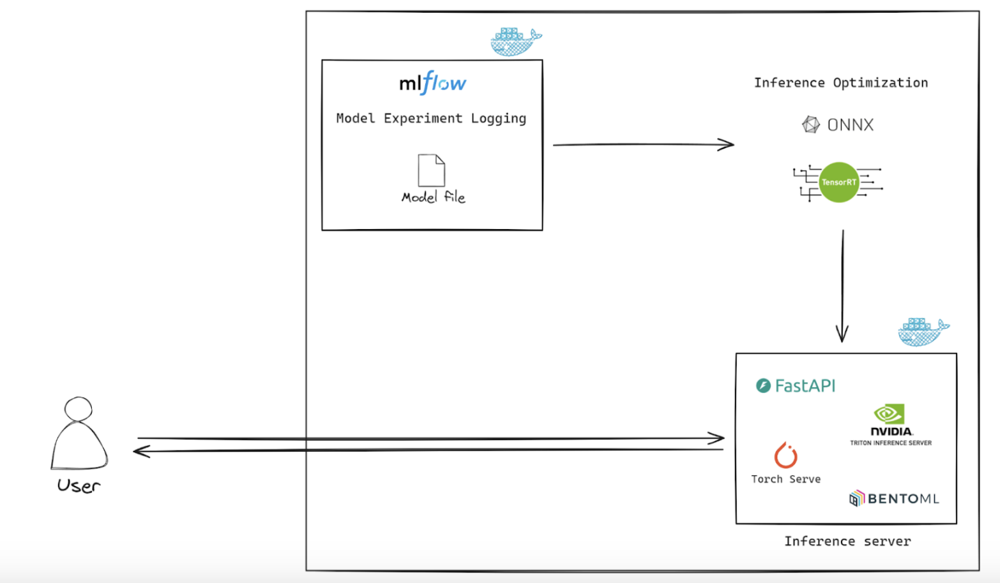</img>

#### 2.1. 사용 기술
- Backend:

      Python Libraries:
        Streamlit
        OpenAI
        Requests
        Pandas
        Numpy
        Matplotlib
        Altair
        Openpyxl
        Statsmodels
        Scikit-learn
        Xlrd
        Plotly

- Machine Learning/Time Series:

        TimeGAN
        ARIMA

- Frontend

      Streamlit Components:
        Streamlit Chat
        Streamlit Calendar
        Streamlit Autorefresh
        Streamlit Extras
        Streamlit JS Eval

- Cloud Infrastructure:
    
      AWS EC2

### 3. 개발결과
#### 3.1. 전체시스템 흐름도

</img>

#### 3.2. 기능설명
   ① 사전 설문조사 (마이데이터 동의 후 SKIP 가능)

   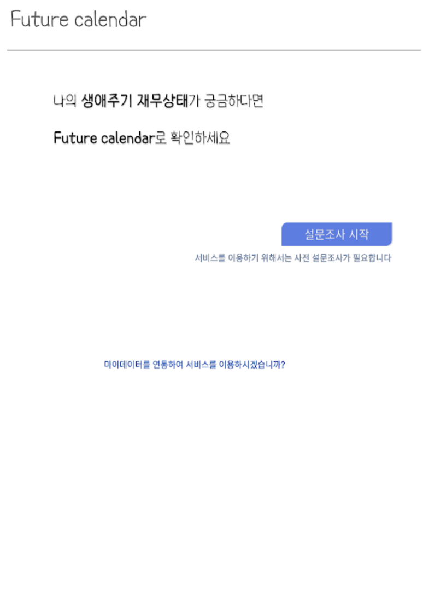</img>
    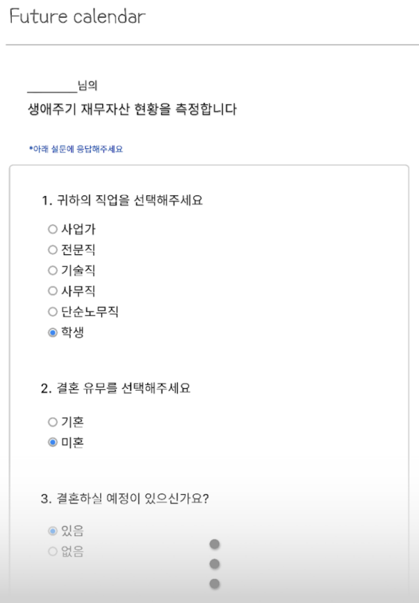</img>

   
   ② 메인화면

  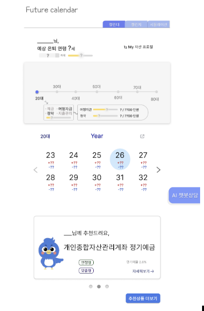</img>

   ③ 챌린지

  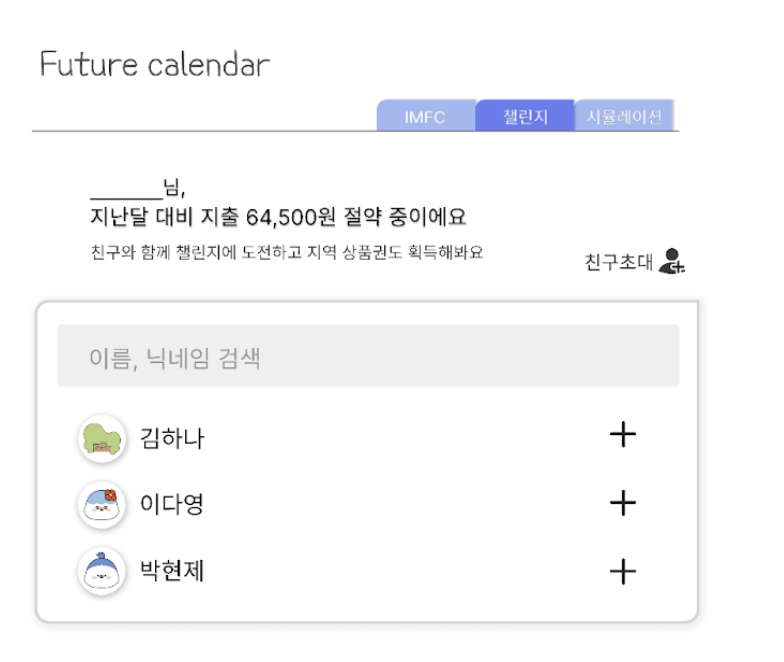</img>
  </img>
  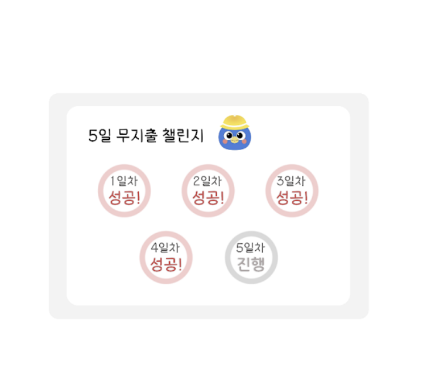</img>

   ④ 시뮬레이션

  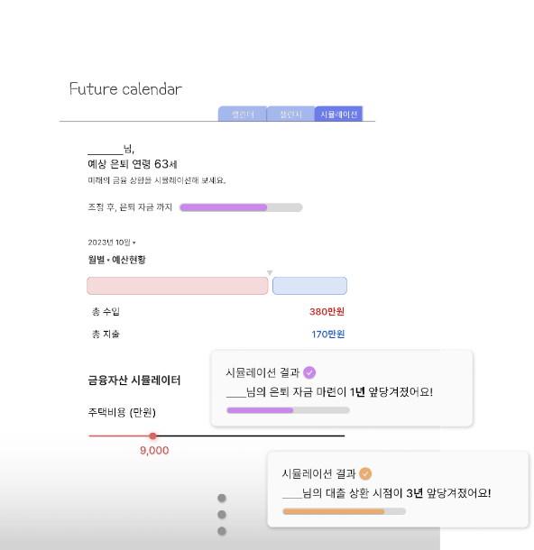</img>

   
   ⑤ 마이페이지

   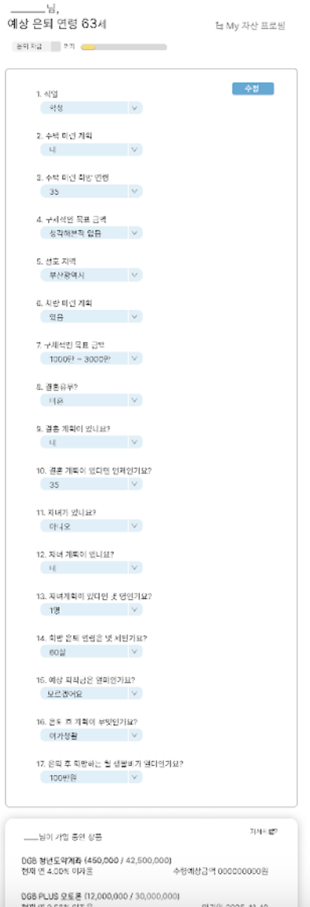</img>

   ⑥ AI 챗봇

   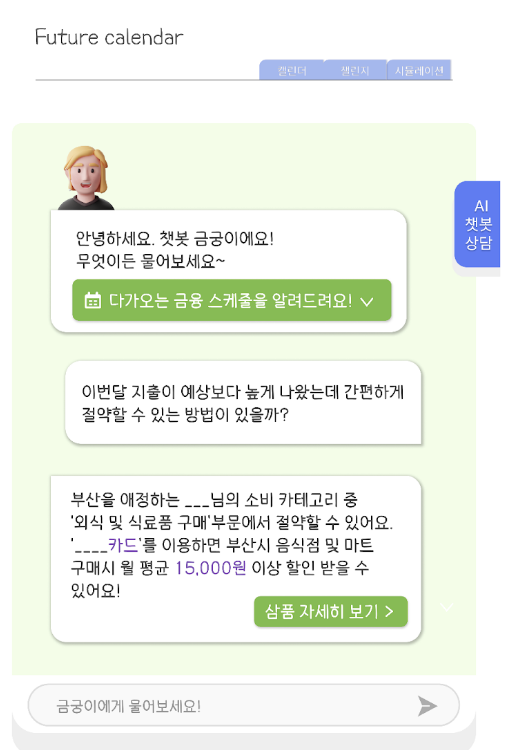</img>

#### 3.3. 기능명세서
[기능명세서 살펴보기(Web Version)](./src/기능명세서.pdf)

   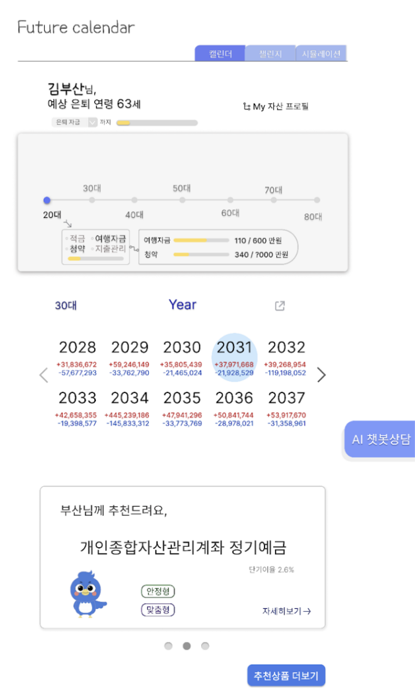</img>
   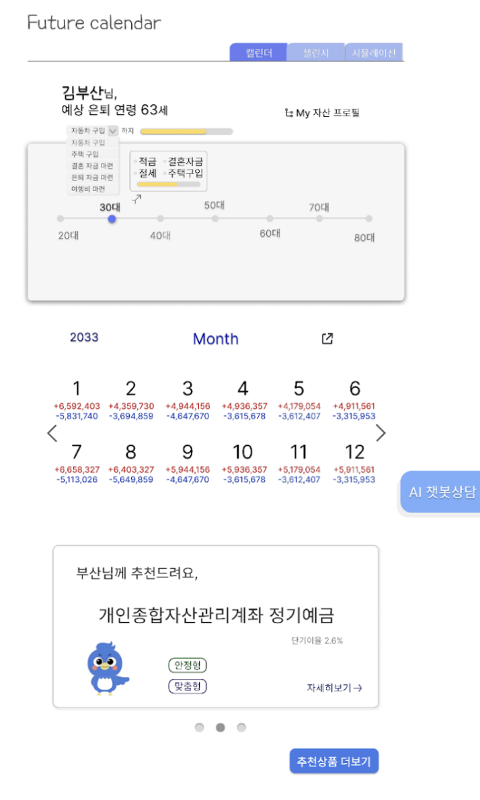</img>
   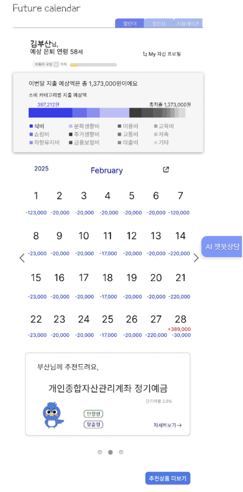</img>

#### 3.4. 디렉토리 구조
    ├── __pycache__/
    ├── customFonts/
    ├── data/
    ├── stock_data/
    ├── .gitignore
    ├── README.md
    ├── SAMPLE_README1.md
    ├── answer.json
    ├── chatbot.py
    ├── container_test.py
    ├── dashboard.py
    ├── data_exploration.py
    ├── excel.py
    ├── fin_calendar.py
    ├── font_test.py
    ├── for_clustering_norm.csv
    ├── functions.py
    ├── get_user_data.py
    ├── life_cycle.py
    ├── main_app.py
    ├── nd.png
    ├── portfolio.py
    ├── prediction.py
    ├── requirements.txt
    ├── simulation.py
    ├── stamps_korea.csv
    ├── survey.py
    ├── visualize.py
    ├── web_demo2.py
    ├── 통합 문서1.xlsx

### 4. 설치 및 사용 방법
> git clone https://github.com/The-5th-PNU-Convergence-SW-Hackathon/PNUSW-2024-team-16.git
>
> cd PNUSW-2024-team-16
>
> pip install -r requirements.txt
>
> streamlit run main_app.py

### 5. 소개 및 시연 영상

### 6. 팀 소개
본 팀은 교내 금융학회에서 만나, 금융과 IT 분야에 대한 공통된 관심사를 바탕으로 각자의 전문성을 살려 팀을 결성하게 되었다. 최종적인 목표는 금융선진국이 되기 위한 시민의 금융지식 함양과 관심도
증진에 기여하는 것이다. 

1) 윤현아 : 무역학부 4학년 재학 중이다. 거시경제 및 금융투자에 관심이 많다. 앱 및 웹 개발 기획과 UI/UX 디자인에도 흥미를 느낀다.새로운 서비스의 이용자 경험 향상을 위한 기획에 대해 생각하는 것 뿐만 아니라 일상생활에서 기존 서비스의 개선할 만한 사항을 스스로 생각해보는 것을 좋아한다.
  이번 프로젝트에서는 다양한 금융권 앱의 UI/UX를 조사하여 Future Calander의 앱 디자인을 맡았다. 피그마를 통해 실제 금융기관 어플과 유사한 UI/UX를 구현하였다. 

 

2) 이다민 : 경영학부 4학년 재학 중이다. 금융감독원의 금융 소비자 리포터로서 다양한 금융 상품에 관한 소비자의 불편 사항을 직접 수집하고, 그에 따른 제도적 개선 방안을 제시하고 있다. 이를 통해 금융 분야의 사회적 가치 창출에 기여하고 있다. 또한, 부산국제경제진흥원 주최 “기업분석 대회 우수상”을 수상하였다. 디지털 금융 환경에서 소비자의 권익을 강화하는 방향으로 기여하고자 한다. 이번 프로젝트에서 기획과 더불어 시장조사 및 발표 자료 제작과 설문지를 제작했다. Future Calander의 사용법과 목적과 구현 과정 등을 알기 쉽게 전달하였다.

 

3) 정다원 : 정보컴퓨터공학부 4학년 재학 중이다. C, C++, JAVA, PYTHON 등의 컴퓨터 언어를 다룰 수 있다. 재테크와 주식에 관심이 많아 교내 금융학회 리서치 팀장으로 활동했따. 부산국제경진흥원 주최 “기업분석대회 최우수상” 수상 등 금융 분야에서도 활발히 활동 중이다. 핀테크 분야의 인재가 되기 위해 IT와 금융 분야 모두에 도전 중이다. 이번 프로젝트에서 개발 및 데이터 수집을 맡았다. 더미데이터를 생성하였으며 데이터 계산 프로그램을 만들었고, 설문지를 제작했다.

 

4) 홍진욱 : 정보컴퓨터공학부 4학년 재학 중이다. 교내 금융학회에서 파생상품팀 팀장으로 활동하며, 금융시장에 대한 이해를 얻었다. 이를 바탕으로 한국 거래소가 주최한 전국 대학생 증권·파생상품경시대회에서 장려상을 수상했다. 또한, 인공지능 분야에서 성취를 인정받아 대통령과학장학생으로 선발되었고 현재는 인공지능과 금융의 융합에 대한 연구에 관해 공부해가고 있다. 이번 프로젝트에서 개발 및 데모 버전 제작을 맡았다. 다양한 AI 모델을 통해 기획한 서비스를 실제로 직접 구현하고 배포하였다.
 

### 7. 해커톤 참여 후기

이다민:
이번 참가를 통해 스타트업 창업자 분과 팀별 멘토링, 경과보고회 및 개발계획서 작성과 해커톤 대회 등 다양한 과정을 통해 저희 팀의 아이디어를 더욱 고도화 시키고, 체계적으로 만들 수 있었습니다. 한 아이템을 가지고 여러 방식으로 표현하는 과정을 통해 관점이 더욱 다양해진 것 같습니다. 주최측에서 이 모든 과정을 주관해주셔서 참여하길 잘했고, 감사한 마음이 듭니다.

홍진욱:
하나의 아이템에 긴 기간 매진하여 개발하고 피드백을 거쳐 수정하고 디벨롭해나가는 과정에서 개발저 뿐만 아니라 사용자의 입장에서 더 깊이 고민하고 실제 프로덕트에 이를 적용해볼 수 있었습니다. 그 과정에서 주최측에서 제공해준 다양한 특강들과 멘토링이 큰 도움이 되었으며 앞으로도 이 경험을 바탕으로 단순히 엔지니어의 관점이 아닌 보다 다양한 각도에서 프로덕트를 바라보며 완성도를 높일 수 있을것 같습니다.

정다원:
창업 프로그램을 하면 가장 크게 느꼈던 부분은 '이론과 실제는 다르다' 였습니다. 스타트업 멘토님께서 저희 팀에게 해주셨던 프로젝트랑 창업은 다르다라는 말이 기억에 남습니다. 프로젝트는 목표를 달성하기 위한 단발성 과제이지만, 창업은 목표를 달성한 이후에도 비즈니스 모델과 지속적인 관리가 필요하다는 의미였습니다. 해커톤 대회 등에서 저희 아이디어를 조금이나마 인정받았지만 창업을 위해서는 조금 더 깊고 장기간의 일정에 대한 고민이 필요하다고 느꼈습니다. 이 점을 잊지 않고 계속해서 발전시켜나가겠습니다.

윤현아:
멘토링을 통해 논리적으로 피칭하기 위한 준비에 대해 상세히 알게되어 많은 도움이 되었습니다。아이디어 피칭을 할 때 투자자 입장에서 설득력있게 인식되도록 하는 것이 중요하다는 것을 다시금 새길 수 있었습니다。세부적으로 방법론적인 부분들까지 도움을 주셔서 명확한 계획을 세워나갈 수 있었습니다。앞으로도 팀의 처음 목표처럼 더욱 많은 분들이 재무 계획에 관심을 가져 금융 지식을 함양할 수 있도록 기여하고 싶습니다。설계 및 실험하여 직접 구현한 결과물을 내는 일련의 과정을 도와주신 주최측과 고생한 팀원들에게 감사드립니다。

  
</img>

